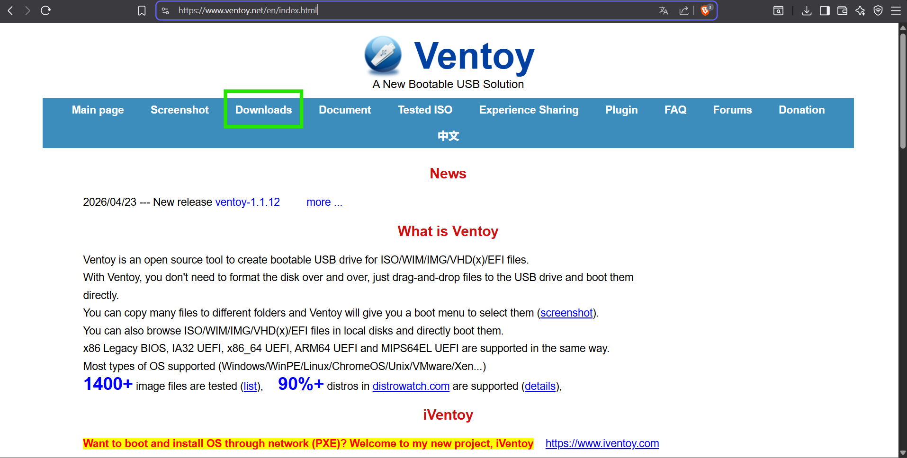
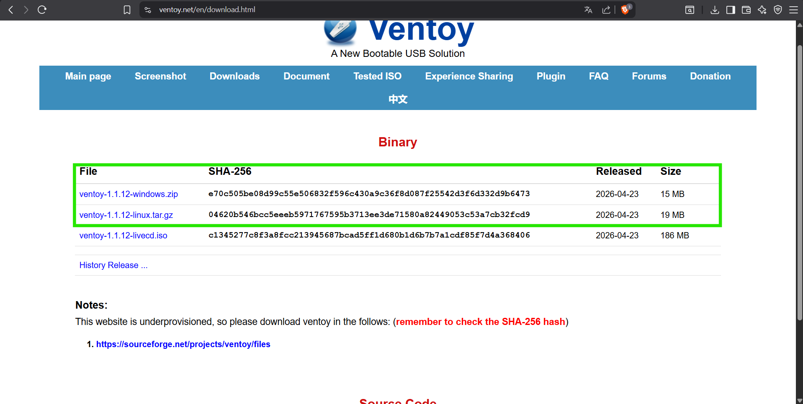
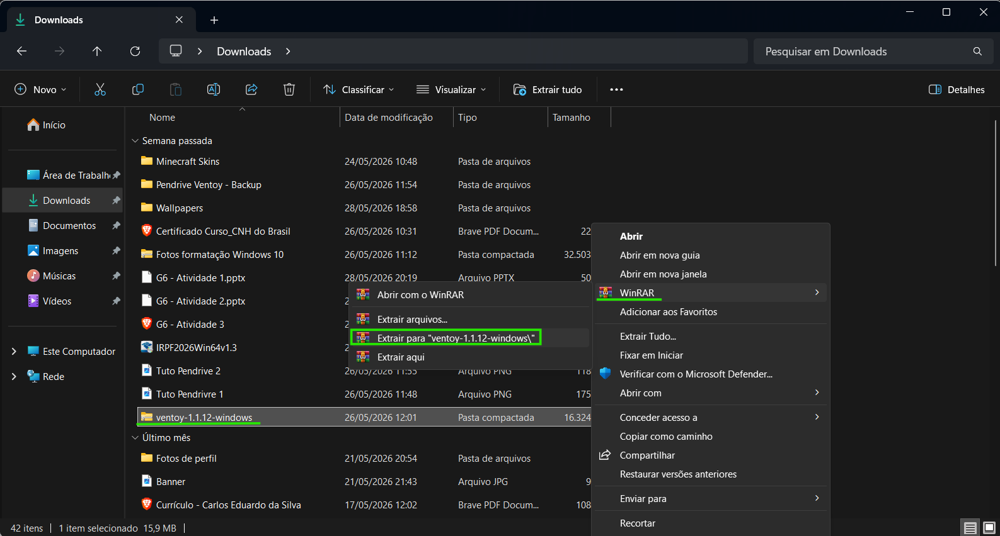
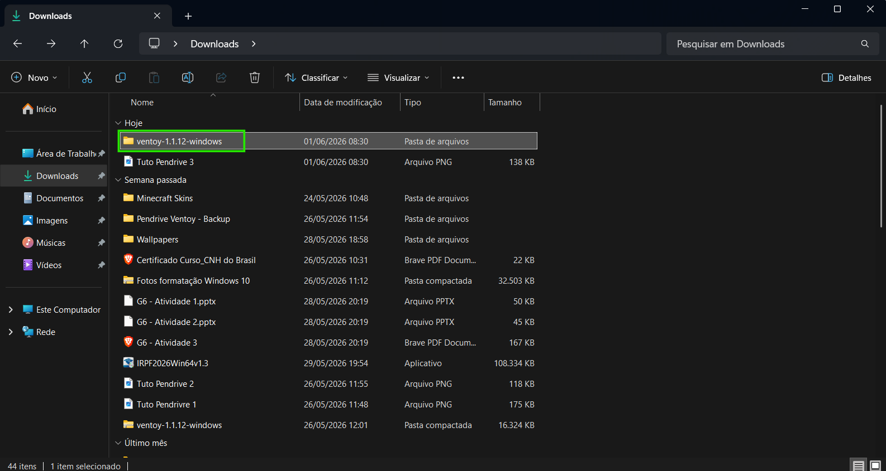
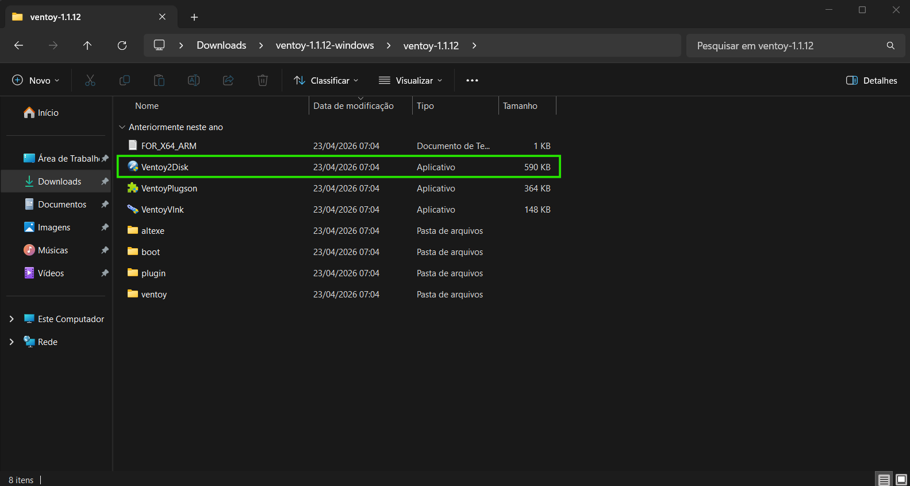
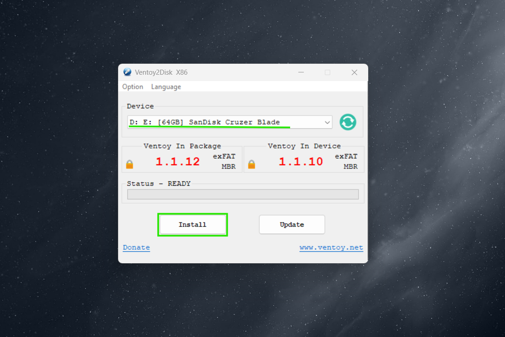
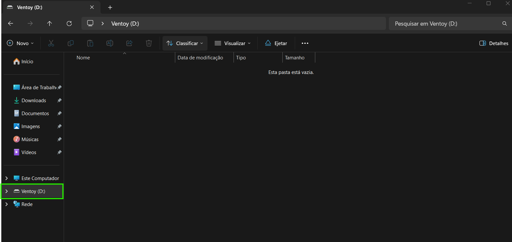
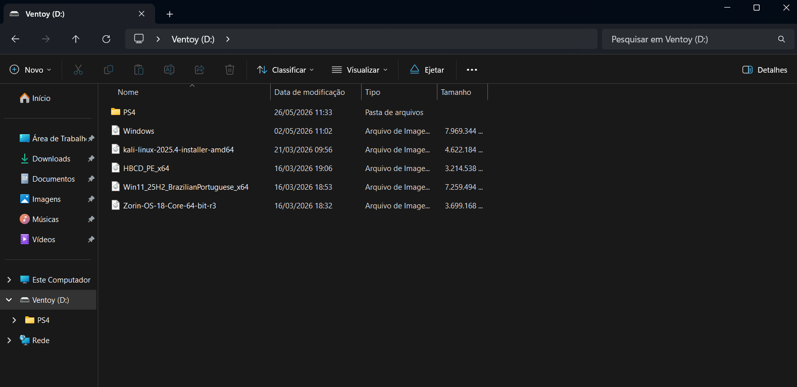

# Como criar um pendrive bootável com um ou mais sistemas operacionais

Este é um tutorial simples explicando como criar um pendrive bootável, permitindo que você realize a instalação de diversos sistemas operacionais sem precisar formatar o pendrive todas as vezes que quiser trocar o arquivo ISO.

## Como criar um pendrive bootável?

O primeiro passo é adquirir um pendrive com uma boa capacidade de armazenamento para armazenar uma ou mais arquivos .ISO. Por recomendação, um pendrive de 32GB e 64GB são ótimas opções!

Assim que adquirir o pendrive, devemos escolher uma ferramenta de boot para preparar o pendrive. Uma ferramenta simples e fácil de usar é a Ventoy, que será a ferramenta que usaremos neste tutorial. Lembrando que existem diversas ferramentas de boot para se usar como: Rufus, Balena Etcher, YUMI, WinToUSB, MulitBootUSB, etc.

Para criar um pendrive bootável pela ferramenta Ventoy, siga o passo a passo abaixo:

### Passo 1:
Acesse seu navegador, navegue até o site oficial da ferramenta Ventoy e acesse a aba “Downloads”.
(link: https://www.ventoy.net/en/index.html)

### Passo 2:
Na aba Downloads, selecione o arquivo compactado da ferramenta Ventoy equivalente ao seu sistema operacional (Windows ou Linux). Você será redirecionado para o site do SourceForge para realizar o download da ferramenta.

### Passo 3:
Após baixar a ferramenta, acesse seu gerenciador de arquivos e descompacte a pasta

Acesse a pasta descompactada

E inicie a ferramenta Ventoy

### Passo 4:
Selecione o pendrive que realizaremos a instalação dos arquivos da ferramenta Ventoy e clique no botão “Install”, realize as confirmações para iniciar a instalação.

### Passo 5:
Após a instalação terminar, em seu gerenciador de arquivos, o nome do pendrive será substituído por “Ventoy (letra do disco)”, indicando que a instalação da ferramenta e a configuração do pendrive foi realizada com sucesso!

### Passo 6:
Depois da instalação e configuração do pendrive, você já pode colocar diversos arquivos ISO’s de diferentes sistemas operacionais e pastas com outros arquivos diferentes sem se preocupar em formatar o pendrive toda hora!

Carlos Eduardo da Silva
01/06/2026
Estudante do curso Análise e Desenvolvimento de Sistemas

