# Como solucionar o problema de um software precisar de permissões de administrador para ser executado

Este é um tutorial simples para a equipe da Central de serviços, explicando como solucionar o problema de um software precisar de permissões de administrador sempre que ele for executado. 
Para solucionar esta demanda, vamos utilizar o programa “SEFIP – Caixa Econômica Federal” do banco CAIXA e realizar o processo dentro de um usuário Teste da equipe da Central de Serviços para exemplificar o problema.
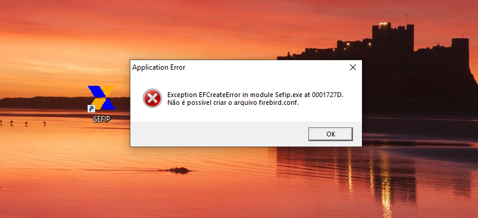

O programa SEFIP não consegue ser executado devido à falta de privilégios de administrador, abaixo estão dois métodos de solução com suas respectivas instruções passo a passo.

## Método 1 - Via propriedades no Atalho do software
### Passo 1: Clique com o botão direito no atalho do software e entre em propriedades, depois vá para a aba “Segurança”.

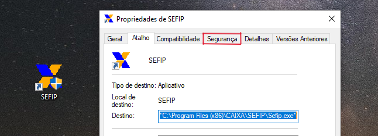

### Passo 2: Na aba de Segurança clique no botão “Editar” para alterar as permissões do atalho (insira suas credenciais de administrador para uma nova janela ser aberta).

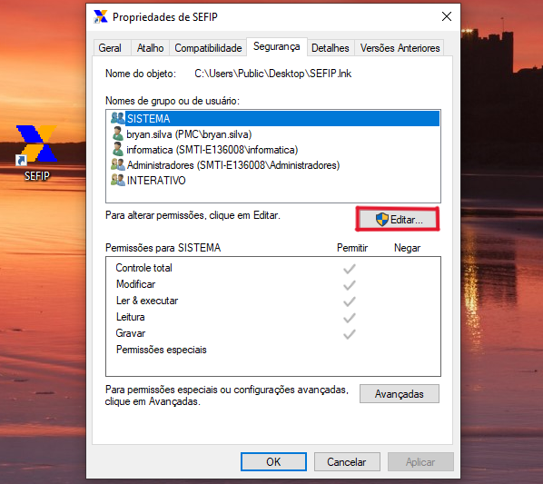

### Passo 3: Na aba de permissões do atalho, clique no botão “Adicionar” para adicionar outro usuário nas propriedades do aplicativo.

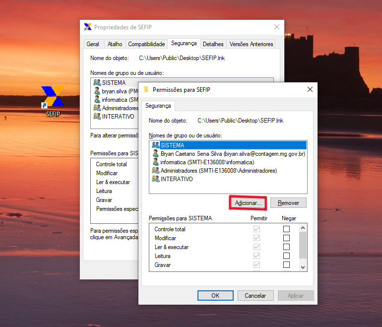

### Passo 4: No campo de texto, digite o nome do usuário e clique no botão “Verificar nomes” para identificar o login do usuário no domínio da Prefeitura (pmc.intra). Isso vai fazer com que o nome e as informações do e-mail do usuário apareçam no campo de texto.

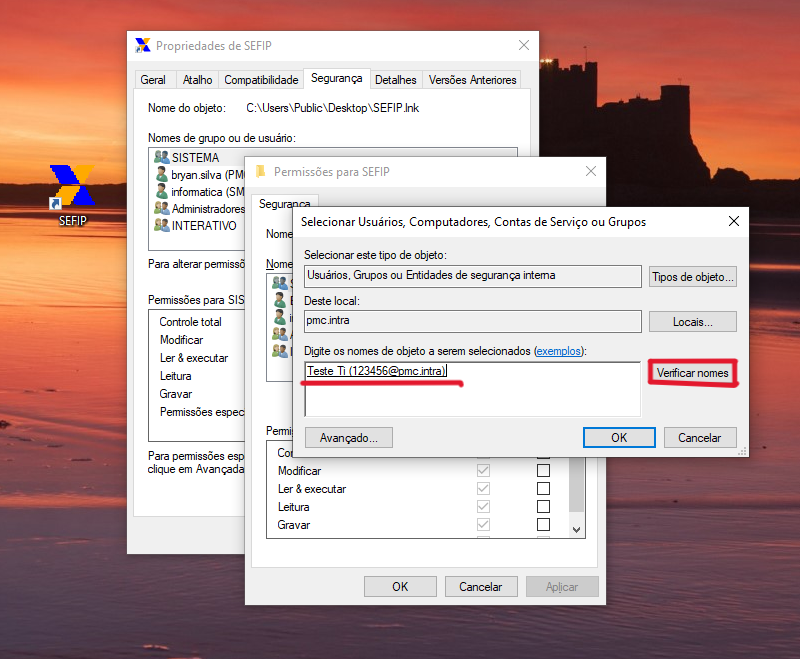

Obs.: Caso o nome não seja encontrado, verifique se a busca esteja sendo feita no domínio da prefeitura e não localmente no computador no campo “Deste local”. Para verificar os locais de busca, clique no botão “Locais...”.
A busca deve ser feita dentro do domínio pmc.intra e não no computador local.

### Passo 5: Após selecionar o usuário, ele vai aparecer na lista de “Nomes de Grupo ou de Usuário”. Em seguida, com o usuário selecionado, na tabela “Permissões para [nome do usuário]”, marque a opção de permitir em controle total e depois clique no botão ”Aplicar”.

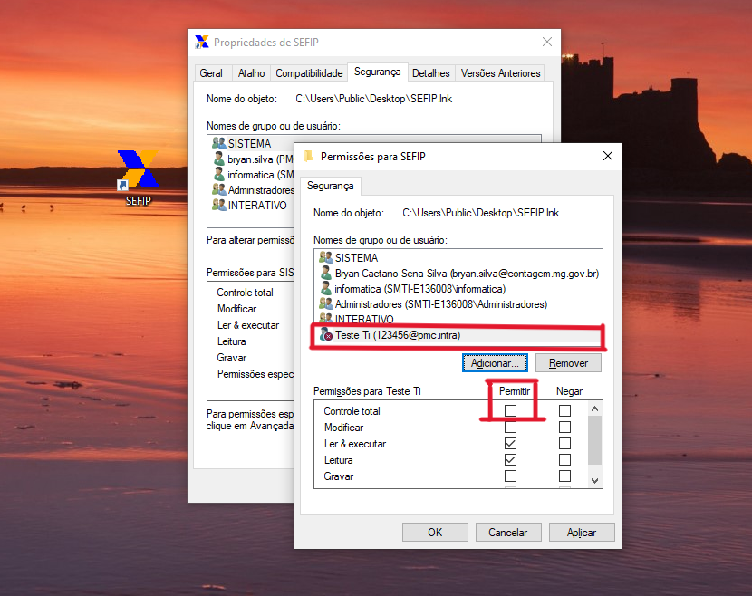

Isso vai fazer com que o atalho seja executado normalmente na área de trabalho do usuário, sem precisar de permissões de administrador para executar o software.

Caso o método 1 não funcione, continue o tutorial para o método 2 onde será feito o mesmo processo, porém, na pasta de arquivos do software.

## Método 2 - Via propriedades dos arquivos do software
Passo 1: Clique com o botão direito no atalho do aplicativo e entre em “Abrir local do arquivo”. Você será redirecionado para a pasta onde o executável do software está localizado, junto com seus arquivos.

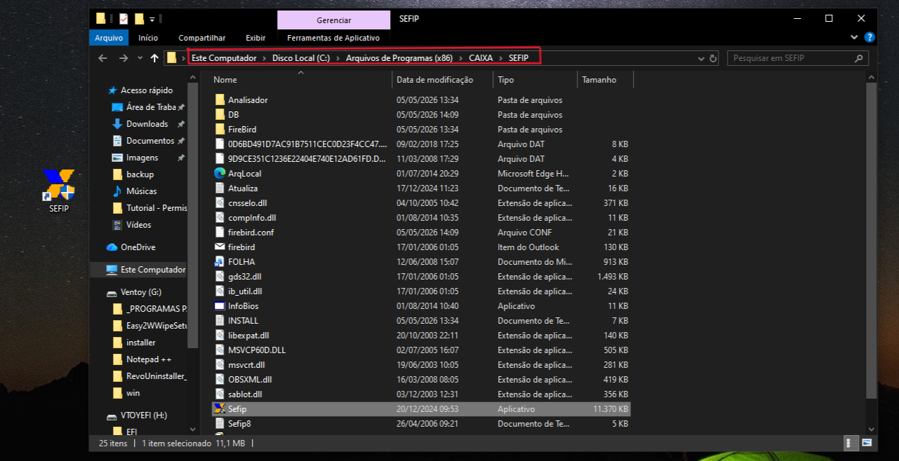

Marcado em vermelho está o endereço onde os arquivos do software estão localizados, você deve localizar onde estes arquivos estão situados para poder realizar as alterações na pasta correta. Neste exemplo, os arquivos do executável “SEFIP” estão localizados na pasta SEFIP, esta será a pasta em que vamos modificar.
Após identificar a pasta que contém todos os arquivos e o executável do software, clique com o botão direito nela e entre em propriedades na aba “Segurança”.

Passo 2: Ao entrar na aba de Segurança clique no botão “Editar” para alterar as permissões da pasta (insira suas credenciais de administrador para uma nova janela ser aberta).

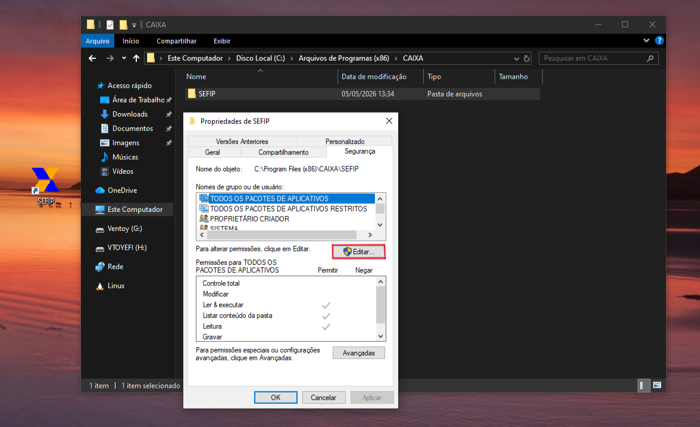

Passo 3: Após entrar na aba de permissões da pasta, clique no botão “Adicionar” para adicionar outro usuário nas propriedades da pasta.

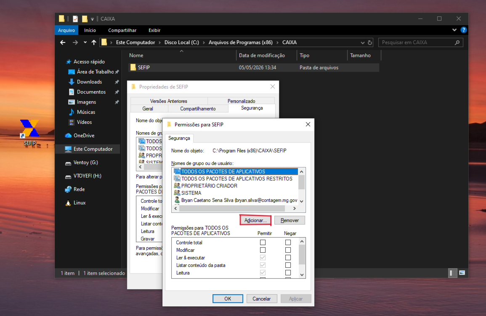

Passo 4: No campo de texto, digite o nome do usuário e clique no botão “Verificar nomes” para identificar o login do usuário no domínio da Prefeitura (pmc.intra). Isso vai fazer com que o nome e as informações do e-mail do usuário apareçam no campo de texto.

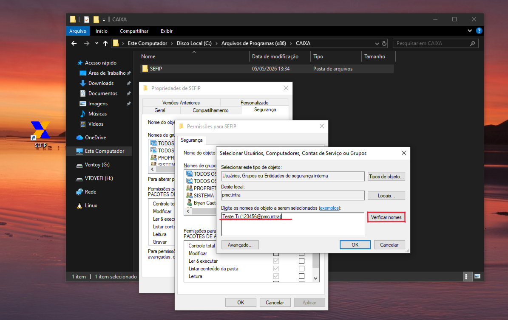

Obs.: Caso o nome não seja encontrado, verifique se a busca esteja sendo feita no domínio da prefeitura e não localmente no computador no campo “Deste local”. Para verificar os locais de busca, clique no botão “Locais...”.
A busca deve ser feita dentro do domínio pmc.intra e não no computador local.

Passo 5: Após selecionar o usuário, ele vai aparecer na lista de “Nomes de Grupo ou de Usuário”. Em seguida, com o usuário selecionado, na tabela “Permissões para [nome do usuário]”, marque a opção de permitir em controle total e depois clique no botão ”Aplicar”.

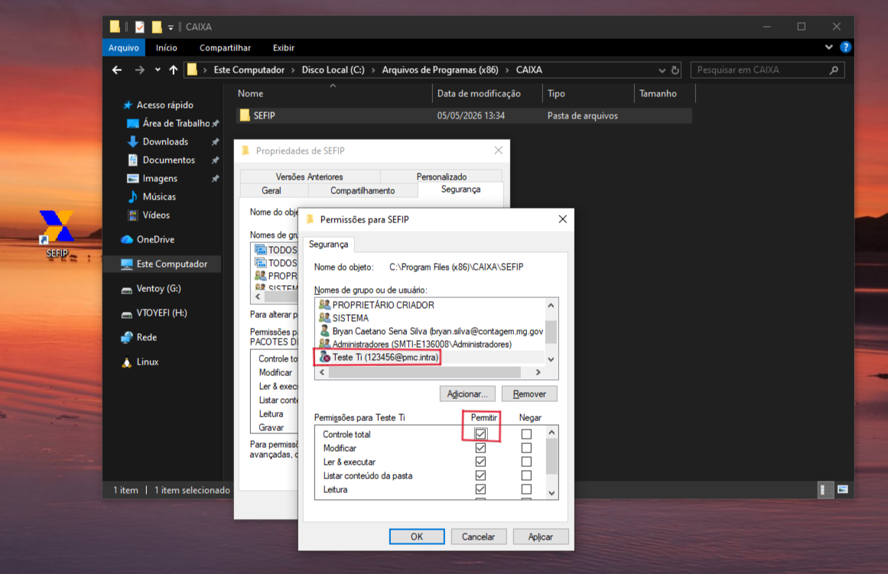

Isso vai fazer com que o atalho seja executado normalmente na área de trabalho do usuário, sem precisar de permissões de administrador para executar o software.

Resultado:
Após executar o primeiro método, ou os dois, o software deve ser executado normalmente sem a exigência de privilégios de administrador. Realizar a confirmação pedindo para que o usuário teste o software.

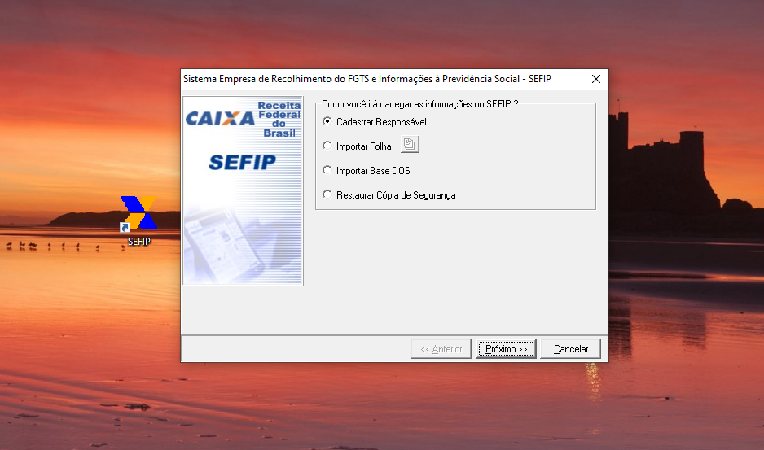

Atenciosamente;
Carlos Eduardo da Silva
Matrícula: 01627079
Secretaria de Tecnologia da Informação / Central de Serviços
Prefeitura Municipal de Contagem - 2026
